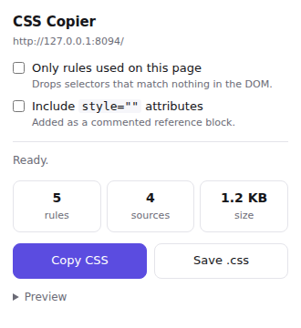

# CSS Copier

A Chrome/Edge (Manifest V3) extension that copies **all** of a page's CSS to the
clipboard or to a `.css` file — external stylesheets, `<style>` blocks, shadow
DOM styles, same-page iframes, and optionally inline `style=""` attributes.



## What it collects

| Source | Handled how |
| --- | --- |
| `<link rel="stylesheet">`, same-origin | Read straight from the CSSOM |
| `<link rel="stylesheet">`, cross-origin | The page is blocked from reading these (`sheet.cssRules` throws), so the extension's service worker re-fetches the URL and the text is merged in |
| `<style>` blocks | Read from the CSSOM, labelled by `id` or position |
| Constructed / `adoptedStyleSheets` | Included |
| Open shadow roots | Walked and included, labelled by host element |
| Iframes | Collected in every frame (`allFrames: true`) and labelled with the frame URL |
| `style=""` attributes | Optional, emitted as a commented reference block (they are not valid standalone CSS) |
| `@media`, `@supports`, `@container`, `@layer`, `@font-face`, `@keyframes`, `@property` | Preserved, including nesting |

Duplicate sources (the same sheet reached from several frames) are emitted once.

## The two modes

- **Everything** (default) — every rule from every source, in load order.
- **Only rules used on this page** — each selector is tested against the live DOM
  with `querySelector`, and rules that match nothing are dropped. Group rules
  (`@media` and friends) are pruned recursively and emptied groups are removed;
  `@font-face`/`@keyframes`/`@property` are always kept since they have no
  selector to test. Pseudo-elements (`::before`) and state pseudo-classes
  (`:hover`, `:focus`) are stripped before the test, so `a:hover` survives as
  long as some `a` exists. A selector the browser cannot parse is kept rather
  than silently dropped.

  This is a snapshot of the DOM *right now* — CSS for menus, modals or states
  that have not been rendered yet will be reported as unused. Open the UI you
  care about first, then collect.

## Install (unpacked)

1. `chrome://extensions` → enable **Developer mode**.
2. **Load unpacked** → select this `css-copier-extension` folder.
3. Pin the extension, open any page, click the icon.

Works in Chrome, Edge, Brave, Arc and other Chromium browsers. Firefox needs a
`browser_specific_settings` key in the manifest and a background *scripts* entry
instead of a module service worker; the rest of the code is API-compatible.

## Permissions, and why

| Permission | Why |
| --- | --- |
| `activeTab` | Touch the page only when you click the toolbar button |
| `scripting` | Inject the collector into the page's frames |
| `host_permissions: <all_urls>` | Let the service worker fetch cross-origin stylesheets the page itself cannot read. Without it, CDN-hosted CSS comes back empty |

Nothing is uploaded anywhere: collection happens in the page, the result goes to
your clipboard or a local file. There is no analytics, no remote endpoint and no
storage beyond the current popup session.

## Layout

```
manifest.json
src/
  popup/popup.html      popup markup
  popup/popup.css       popup styling (light + dark)
  popup/popup.js        orchestration, output assembly, copy/save
  content/collector.js  the function injected into the page (self-contained)
  background/service-worker.js  fetches cross-origin stylesheets
tests/e2e.test.mjs      loads the extension in Chromium and checks both modes
icons/
```

`src/content/collector.js` is stringified by `chrome.scripting.executeScript`,
so it must stay self-contained — no imports, no references to anything outside
its own body.

## Tests

```bash
npm install
npm test          # CHROME_PATH=/path/to/chrome to use a specific binary
```

The test serves a page across two origins (one without CORS headers), loads the
unpacked extension into Chromium, drives the real popup and asserts that inline,
same-origin, cross-origin and iframe CSS all arrive — and that "used only" keeps
the used rules and drops the rest.

## Known limits

- Browser-internal pages (`chrome://`, the extension store, the PDF viewer)
  cannot be scripted; the popup says so.
- Closed shadow roots are invisible to any extension by design.
- CSS behind `@import` inside a *fetched* cross-origin sheet is not followed.
- Stylesheets over 8 MB are skipped by the fetcher.
