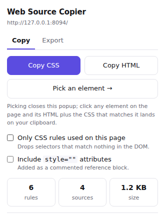
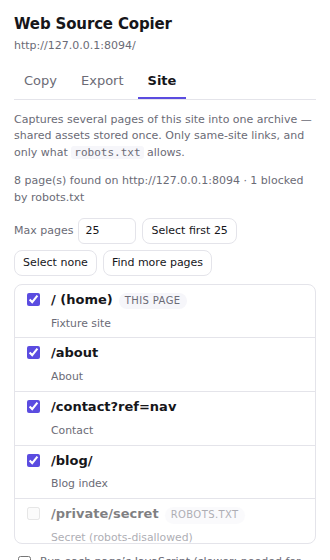
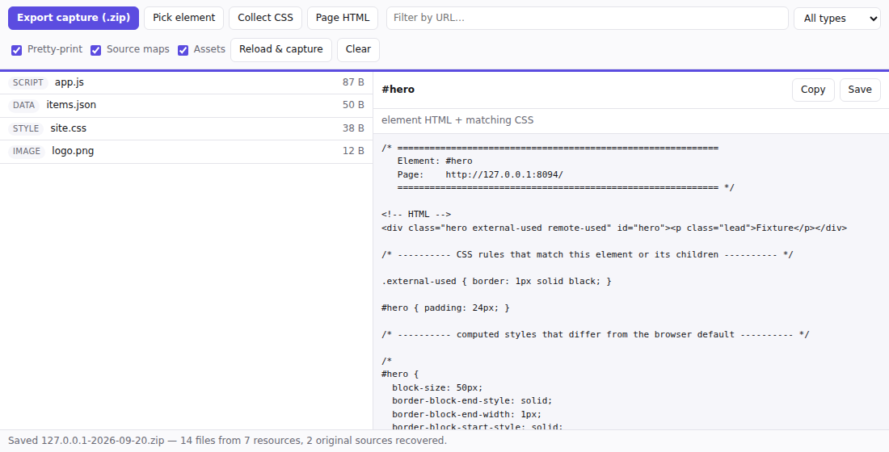

# Web Source Copier

A Chrome/Edge (Manifest V3) extension that inspects and copies **everything a
website is built from** — HTML, CSS, JavaScript, JSON/API responses, images,
fonts, wasm — and, where the site ships source maps, the **original pre-build
sources** behind its bundles: TypeScript, JSX, Vue/Svelte, SCSS.

| Popup — quick copy and export | Site tab — many pages at once | DevTools panel — the deep work |
| --- | --- | --- |
|  |  |  |

## First, the honest limit

A browser extension can copy everything the server **sent**. It can never copy
the code that ran **on** the server to produce it:

- PHP, Ruby, Python, Node, Java, .NET source
- server-side templates (Blade, Twig, ERB, Jinja, Razor, JSP)
- database schemas, queries or contents
- `.env` files, API keys, routes, cron jobs

A `.php` URL in a capture is the *output* of a PHP script, not the script. Any
tool that claims otherwise is lying to you.

The nearest honest equivalent is **source maps**, and this extension goes after
them: most production sites publish `.js.map` / `.css.map` files next to their
bundles, and those maps usually embed `sourcesContent` — the real, unminified
project tree as it existed before the build. When a site ships them, `src/` in
your capture is the site's actual development source.

## What it does

### Popup — one click, two tabs

**Copy**
- **Copy CSS** — every rule in play: external stylesheets (including
  cross-origin ones the page itself cannot read), `<style>` blocks, constructed
  and adopted stylesheets, open shadow roots, and every iframe. Optionally
  filtered to only the rules that match something in the live DOM.
- **Copy HTML** — the rendered DOM, pretty-printed.
- **Pick an element** — closes the popup, hands you a crosshair; click anything
  and its HTML plus *only the CSS that matches it and its children* (plus the
  `@font-face`/`@keyframes` in scope and its non-default computed styles) lands
  on your clipboard. Cross-origin stylesheets are fetched and re-parsed first,
  so CDN-hosted rules are in the snippet too, credited to the sheet they came
  from — and their relative `url()` references are rewritten to absolute, so the
  snippet still renders when you paste it elsewhere.

**Export**
- **Export capture (.zip)** — this page and everything it loads, written
  client-side (no server, no upload).

**Site** — capture *several pages* into one archive:
- lists the pages this page links to (same site only), the current one first
- reads the site's `robots.txt` first; pages it disallows are shown greyed with
  a `robots.txt` tag and cannot be selected
- **Max pages** defaults to 25; raise it to select more, and the picker refuses
  to go past whatever it is set to
- **Find more pages** crawls one level deeper from what you have selected
- each page's HTML lands in `pages/`, while assets shared between pages are
  stored **once** in `files/`
- the page you started from is captured as rendered; the others are captured as
  served, unless you tick **Run each page's JavaScript**, which loads each one
  in a background tab so app-rendered content is included

### DevTools panel — "Source Copier"

Open DevTools → **Source Copier**. The panel listens to the network as the page
loads, so it sees **response bodies the popup cannot**: XHR and `fetch` JSON,
API responses, POST results, and anything loaded before you clicked the toolbar
icon. Click **Reload & capture** to record a page from its first byte.

- Filter by URL or type, click any resource to view it pretty-printed
- **Copy** or **Save** any single file
- **Recover sources** on any bundle with a source map — lists the original
  files, click one to read it, copy or save it
- **Export capture (.zip)** here prefers recorded bodies over refetching, which
  is what puts live API responses into the archive
- **Pick element**, **Collect CSS** and **Page HTML** feed straight into the
  viewer

## What a capture contains

A site capture:

```
example.com-2026-09-20/
├── README.md              pages captured, robots.txt outcome, failures
├── inventory.json         every page and every resource
├── pages/
│   ├── index.html         the page you started from (rendered)
│   ├── about.html
│   ├── blog/index.html
│   └── pages.json         url ↔ file, how it was captured, result
├── collected.css          every rule in play on the starting page
├── files/example.com/…    assets, stored once and shared by all pages
└── src/                   original sources, if the site ships maps
```

A single-page capture:

```
example.com-2026-09-20/
├── README.md              what was captured, what failed, what is impossible
├── inventory.json         every resource: url, type, size, archive path
├── rendered-page.html     the DOM after JavaScript ran
├── original-page.html     the HTML the server actually sent
├── collected.css          every CSS rule, shadow DOM and iframes included
├── inline-scripts/        <script> blocks that have no URL of their own
├── files/example.com/…    every asset, in the site's own folder structure
└── src/                   ORIGINAL sources recovered from source maps
    └── my-app/src/components/Button.tsx
```

Options: pretty-print minified code, recover source maps, include or skip
binary assets.

## How it works

| Problem | Approach |
| --- | --- |
| Cross-origin stylesheets throw on `sheet.cssRules` | The extension refetches them with host permissions (service worker for the popup's CSS copy, direct `fetch` from the extension page for exports) |
| "Which rules are actually used?" | Every selector is tested against the live DOM with `querySelector`, recursing into `@media`/`@supports`/`@container` and dropping emptied groups. Pseudo-elements and state pseudo-classes are stripped first, so `a:hover` survives as long as an `a` exists |
| XHR/API bodies are not refetchable | The DevTools panel reads them out of the network recording (`getContent`) instead |
| The element picker runs *in* the page, where cross-origin CSS is unreadable | The extension fetches those sheets before the picker starts and passes the text in; the picker re-parses them as constructed stylesheets and matches against them like any other source |
| The popup closes the instant you click the page | The service worker owns the picker injection, so it outlives the popup; the page copies from inside its own click handler, where the clipboard is allowed |
| Minified bundles are unreadable | Tokenizer-based formatters that only ever *insert* whitespace — strings, comments, regex literals and template literals are passed through untouched |
| ZIP without a library | `CompressionStream('deflate-raw')` plus a hand-written central directory. Already-compressed formats (PNG, WOFF2, MP4 …) are stored rather than deflated — same size, a quarter of the CPU |
| Capture speed | Downloads run 8 at a time (`concurrency`), identical URLs are de-duplicated in flight, and a host that times out three times is dropped rather than waited on again |
| Original sources | `sourceMappingURL` (including inline `data:` maps and index maps with `sections`) → `sourcesContent` → a real folder tree |
| Which pages may be captured | `robots.txt` parsed per RFC 9309 — user-agent groups, `Allow`/`Disallow`, `*` and `$` patterns, longest-match-wins — consulted before any page is fetched |
| Pages a fetch cannot render | Optionally loaded in a background tab, read the same way the live page is, then closed |

## Install (unpacked)

1. `chrome://extensions` → enable **Developer mode**
2. **Load unpacked** → select this `web-source-copier` folder (the one with
   `manifest.json` in it)
3. Pin it; open any page; click the icon, or open DevTools → **Source Copier**

No build step and no `npm install` — the extension runs as it sits on disk.
**[docs/GETTING-STARTED.md](docs/GETTING-STARTED.md)** walks through install,
first use, the panel, updating and troubleshooting in more detail.

Chrome, Edge, Brave, Arc and other Chromium browsers. Firefox needs a
`browser_specific_settings` key and a background *scripts* entry instead of a
module service worker; the rest is API-compatible.

## Permissions

| Permission | Why |
| --- | --- |
| `activeTab` | Touch the page only when you click the toolbar button |
| `scripting` | Inject the collectors into the page's frames |
| `host_permissions: <all_urls>` | Refetch cross-origin stylesheets and assets the page itself is not allowed to read. Without it, CDN-hosted CSS and JS come back empty |

Nothing is uploaded anywhere. Collection happens in the page and in the
extension; output goes to your clipboard or a local file. No analytics, no
remote endpoint, no storage between sessions. Assets are fetched without
credentials; only on a `401`/`403` does the extension retry with the site's own
cookies, so logged-in pages still capture.

## Layout

```
manifest.json
src/
  popup/                  toolbar popup (copy + export)
  devtools/               DevTools page + "Source Copier" panel
  background/             service worker: cross-origin stylesheet fetches
  lib/
    css-collector.js      page-side CSS walker           (injected)
    page-inventory.js     page-side resource inventory   (injected)
    element-inspector.js  page-side element picker       (injected)
    picker.js             picker driver: fetches the CSS the page cannot read
    site.js               multi-page capture: discovery, crawl, per-page capture
    robots.js             robots.txt parsing (RFC 9309)
    html-scan.js          DOMParser-side scanning of fetched pages
  ui/site-picker.js       the page picker, mounted by both surfaces
    bundle.js             capture pipeline → ZIP
    zip.js                ZIP writer (deflate-raw)
    format.js             JS/CSS/HTML/JSON pretty-printers
    net.js                fetch guards (every request carries a timeout)
    sourcemap.js          source map → original sources
tests/
  unit.test.mjs           zip, formatters, source maps (Node)
  e2e.test.mjs            the real popup and panel in Chromium
  fixtures/site.mjs       two-origin fixture site
```

The three files marked *injected* are stringified by
`chrome.scripting.executeScript`, so they must stay self-contained — no
imports, no references to anything outside their own body.

## Tests

```bash
npm install
npm test                 # unit + e2e
npm run test:unit        # no browser needed
npm run test:e2e         # CHROME_PATH=/path/to/chrome to pick a binary
npm run test:site        # multi-page capture against the fixture site
npm run test:real -- https://pypi.org/   # drive it against a live site
```

The e2e test loads the unpacked extension into Chromium against a two-origin
fixture (the second origin deliberately sends no CORS headers) and drives the
shipped UI: both CSS modes, a full ZIP export (unzipped and inspected file by
file, including source-map recovery), the DevTools panel's list/viewer/recovery,
the element picker clicking a real page, and a panel export that proves recorded
API bodies beat refetching.

Only two seams are stubbed, because Playwright cannot reach them: the popup's
`chrome.tabs.query` (it would otherwise target the test tab itself) and the
panel's `chrome.devtools` host object. Everything below those is shipped code.

### Against live sites

`tests/real-site.mjs` runs the same flow against a real URL and prints what it
got. Two runs, both clean:

Site capture was exercised live too: from `pypi.org`, 11 linked pages were
offered and **3 were withheld by PyPI's own robots.txt** (`/account/login/`,
`/account/register/`, `/search/` — its `Disallow: /account/` and `Disallow:
/search*` rules). Capturing 4 of the remainder produced 348 files with 126
assets shared across the pages and **zero duplicated**.

**pypi.org** — 3,376 CSS rules collected (295 after "used only"); a 1.88 MB
archive of 334 files in 10s; **213 original sources recovered** from
Warehouse's source maps, including its whole SCSS tree and Stimulus
controllers. Spot-checked against `pypi/warehouse@main`: recovered files are
byte-identical to the project's own repository. The captured
`fa-solid-900.woff2` matches the server byte for byte, and the pretty-printed
`warehouse.js` (109.8 KB minified → 164.7 KB across 5,046 lines) keeps every
non-space character.

**jsr.io** — a Deno Fresh/Preact/Tailwind app: 2,207 rules (694 used), 40
files, no source maps published, so `src/` is correctly empty. The picker
returned 393 lines of matching CSS with Tailwind's
`@layer properties { @supports … }` nesting rebuilt correctly.

**code.claude.com/docs** — a Next.js documentation app, the most complex of the
three: 4,701 rules across 9 stylesheets (1,267 used), 94 resources archived
(37 scripts, 15 fonts, RSC flight payloads, a 526 KB chunk pretty-printed to
10,657 lines), a cross-origin Google Fonts stylesheet the page cannot read, and
a captured `.woff2` byte-identical to the server. Next.js ships no production
source maps, so `src/` is empty — correctly. Anything the sandbox's egress
policy refused is listed in the archive's own `README.md`.

`SITE_PAGES=4 npm run test:real -- https://pypi.org/` additionally drives a live
multi-page capture, robots.txt and all.

Live runs need the open internet; behind a TLS-intercepting proxy, pass that
proxy's CA SPKI hashes via `SPKI_PINS` (see the comment at the top of the
file).

## Speed

Captures are dominated by two things, and both are handled:

| Stage | Was | Now |
| --- | --- | --- |
| Downloading 132 resources (pypi.org) | 2,990 ms, one at a time | **203 ms**, 8 at a time |
| Pretty-printing 27 files | 8,861 ms | **~450 ms** |
| Zipping 2 MB | 189 ms | **48 ms** (media stored, not deflated) |
| **Whole capture — pypi.org** | **10.1 s** | **1.1 s** |
| **Whole capture — a Next.js docs app, 94 resources** | **176.5 s** | **8.9 s** |

The pretty-printers used to trim trailing whitespace off the *entire* output
string on every newline, which made them quadratic; they now write into a line
buffer. A 110 KB minified bundle went from 8.9 s to 100 ms, byte-for-byte the
same output.

Files larger than `maxFormatBytes` (2 MB) are stored as served rather than
formatted, so one enormous bundle cannot hold up a capture. The archive's
README says when that happened.

## Known limits

- Browser-internal pages (`chrome://`, the extension store, the PDF viewer)
  cannot be scripted.
- Closed shadow roots are invisible to any extension by design.
- `@import` inside a *fetched* cross-origin stylesheet is not followed.
- Files over 12 MB are skipped by the exporter, and a single asset that does not
  answer within 20s is recorded as a timeout rather than stalling the capture
  (both configurable in `bundle.js`).
- Chromium logs a one-off CSP notice ("Refused to load the script …") the first
  time an extension page fetches a URL the inspected page had preloaded as a
  module. It is cosmetic: the fetch then proceeds normally and the bytes are
  captured intact — the live-site test verifies this by comparing against the
  server.
- Keep the popup open while an export runs; long captures belong in the panel.

## Using this responsibly

Captured files stay the copyright of their owners, and some sites' terms
prohibit bulk downloading. This is built for studying how a page is made,
debugging your own site, archiving work you own, and migrating a site you are
responsible for — not for republishing someone else's.
